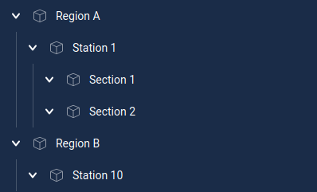

This project was bootstrapped with [Create React App](https://github.com/facebook/create-react-app).

## Задача

Написать приложение, запрашивающее данные с сервера и отображающее их в иерархическом виде. Тестовые данные можно загрузить запросом `GET /api/regions` (смотри `./src/server-mock.ts`). Ниже приведен пример ожидаемого результата. При клике по любому элементу дерева, вложенные в него элемены должны скрываться, при повторном клике раскрываться обратно.

